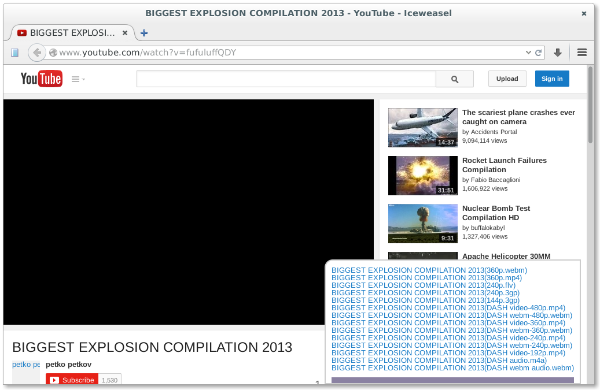

关于
====
这个油㺅脚本主要用于解析常用视频网站里的视频地址, 得到地址后就可以直接使用本地
视频播放器播放(推荐用[VLC][VLC]),
不需要启用Flash插件; 也可以直接下载这些视频, 推荐用[DownThemAll][DownThemAll]
这个非常棒的下载工具.

目前只支持firefox平台, chrome/chromium用户或许可以通过tampermonkey插件来使用, 但未经测试.

类似项目
========

* [you-get][you-get] - 用python3写的视频网站下载脚本, 用的人挺多的;
* [youtube-dl][youtube-dl] - 与you-get类似, 也用于下载
视频网站中的视频, 这个项目由国外的朋友维护, 可能对于国内视频网站的支持没有
you-get完善, 但它支持的网站有数十个, 非常丰富,
* [YouAntiAds][YouAntiAds] - 用于解决视频网站的黑屏问题;

安装
====
1. 安装firefox.
2. 安装[greasemonkey扩展][greasemonkey]
3. 安装[monke-videos][monkey-videos]
4. 访问视频网站, 就可以在页面的右下角看到解析好的链接了. 如果需要批量下载这些
视频的话, 我推荐使用[DownThemAll][DownThemAll]这个firefox的扩展, 很方便.

特点
===
* 直接解析出视频的最终下载地址, 而不是调用第三方的视频解析接口
* 即使禁用了页面上的javascript, monkey-videos仍然能工作; 不受
[NoScript][NoScript] 及[YesScript][YesScript] 的影响
* 可以直接生成一个m3u格式的播放列表, 点击"播放列表"后, 可以直接用本地的视频播放器打开, 性能就有了很好的保证, 笔记本安静了很多
* 远离Adobe Flash Player

支持的网站
=========

* [v.163.com, 网易视频][netease]
* [open.163.com, 网易公开课][netease-open-course]
* [acfun.tv, AcFun弹幕视频网][acfun]
* [bilibili.tv, 哔哩哔哩弹幕视频网][bilibili]
* [cntv.cn, 中国网络电视台][cntv]
* [funshion.com, 风行网][funshion]
* [v.ifeng.com, 凤凰视频][ifeng]
* [iqiyi.com, 爱奇艺][iqiyi]
* [justing.com.cn, 静雅思听][justing]
* [ku6.com, 酷6视频][ku6]
* [letv.com, 乐视][letv]
* [pps.com, PPS影音][pps]
* [tv.sina.com.cn, 新浪视频][sina]
* [tv.sohu.com, 搜狐视频][sohu]
* [tucao.cc, 吐槽][tucao]
* [tudou.com, 土豆网][tudou]
* [wasu.cn, 华数TV][wasu]
* [weiqitv.com, 围棋TV][weiqi]
* [youku.com, 优酷][youku]
* [youtube.com, YouTube][youtube]

截图
====

Q&A
===
1.为什么会有这个项目?
Flash插件很不安全, 经常被曝出新的漏洞; 而且它对linux桌面的支持越来越无力, 很久
没有更新.
用浏览器中的flash来播放视频时, 会加重笔记本的负担. 尤其是iqiyi.com, 在爱奇艺
看视频时, CPU的负载能保持在70%左右.
Flash插件可以用于跟踪用户行为, 被称为超级cookie.
几年前, 优酷的flash播放器引入了黑屏特效, 当它检测到它的广告被过滤后, 就会让
flash播放器黑屏, 而且长达数十秒.
从2011年前后, 写了youkuHTML5插件, 也就是从那时起, 我就没再安装过flash插件了.

版权
===
`Copyright (C) 2013-2014 LiuLang <gsushzhsosgsu@gmail.com>`

依照GNU General Public License v3协议发布, 协议内容请参看LICENSE文件.

[DownThemAll]: https://addons.mozilla.org/en-US/firefox/addon/downthemall/
[greasemonkey]: https://addons.mozilla.org/en-US/firefox/addon/greasemonkey/
[monkey-videos]: https://raw.githubusercontent.com/LiuLang/monkey-videos/master/monkey-videos.user.js
[NoScript]: https://addons.mozilla.org/en-US/firefox/addon/noscript/
[VLC]: http://www.videolan.org/vlc/index.html
[YesScript]: https://addons.mozilla.org/en-US/firefox/addon/yesscript/
[you-get]: https://github.com/soimort/you-get
[YouAntiAds]: http://userscripts.org/scripts/show/119622
[youtube-dl]: https://github.com/rg3/youtube-dl

[netease]: http://v.163.com
[netease-open-course]: http://open.163.com
[acfun]: http://acfun.tv
[bilibili]: http://bilibili.tv
[cntv]: http://www.cntv.cn
[funshion]: http://www.funshion.com
[ifeng]: http://v.ifeng.com
[iqiyi]: http://iqiyi.com
[justing]: http://www.justing.com.cn
[ku6]: http://www.ku6.com
[letv]: http://letv.com
[pps]: http://pps.com
[sina]: http://tv.sina.com.cn
[sohu]: http://tv.sohu.com
[tucao]: http://tucao.cc
[tudou]: http://www.tudou.com
[wasu]: http://www.wasu.cn
[weiqi]: http://www.weiqitv.com
[youku]: http://www.youku.com
[youtube]: https://www.youtube.com
